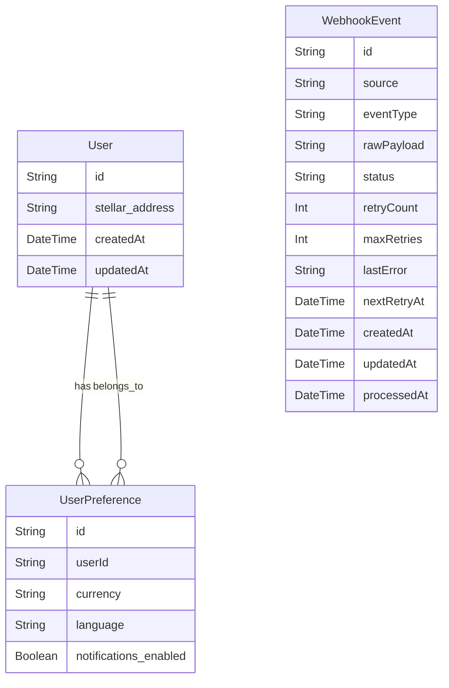

# Data Model and Persistence Boundary

This document describes the current Prisma persistence layer for RemitWise, including the exact Prisma models in `prisma/schema.prisma`, the main persisted entities, and the durability boundary between on-chain, in-memory, and persisted data.

## Current Prisma Models

### `User`

Represents an authenticated user who has signed in with a Stellar address.

- `id: String` — primary key, generated with `cuid()`.
- `stellar_address: String` — unique Stellar public key used as the user identity.
- `createdAt: DateTime` — timestamp when the record was created.
- `updatedAt: DateTime` — auto-updated timestamp when the record changes.
- `preferences: UserPreference?` — optional one-to-one relation to `UserPreference`.

### `UserPreference`

Stores user-specific UI and locale preferences.

- `id: String` — primary key, generated with `cuid()`.
- `userId: String` — unique foreign key to `User.id`.
- `user: User` — relation back to `User`, with `onDelete: Cascade`.
- `currency: String` — selected display currency (default `USD`).
- `language: String` — selected language/locale code (default `en`).
- `notifications_enabled: Boolean` — whether the user has enabled notifications (default `true`).

### `TutorialProgress`

Tracks per-user tutorial state for the in-app education experience.

- `id: String` — primary key, generated with `cuid()`.
- `userId: String` — user identifier.
- `tutorialId: String` — tutorial identifier.
- `data: String` — JSON string that contains chapter progress details.
- `createdAt: DateTime` — timestamp for record creation.
- `updatedAt: DateTime` — timestamp updated on record modification.

Indexes:

- unique composite index: `@@unique([userId, tutorialId])`
- `@@index([userId])`
- `@@index([tutorialId])`

### `WebhookEvent`

Persisted webhook events used for reliable asynchronous processing and retry handling.

- `id: String` — primary key, generated with `cuid()`.
- `source: String` — event origin, e.g. `anchor`, `stripe`.
- `eventType: String` — event type name, e.g. `deposit_completed`.
- `rawPayload: String` — raw JSON body as text.
- `status: String` — processing status; default is `pending`.
- `retryCount: Int` — current retry attempt count, default `0`.
- `maxRetries: Int` — maximum allowed retries, default `5`.
- `lastError: String?` — last failure message, nullable.
- `nextRetryAt: DateTime?` — if failed, when to retry next.
- `createdAt: DateTime` — creation timestamp.
- `updatedAt: DateTime` — auto-updated timestamp.
- `processedAt: DateTime?` — timestamp when processing completed.

Indexes:

- `@@index([status])`
- `@@index([source])`
- `@@index([nextRetryAt])`

## ERD

> Note: `TutorialProgress` is also in Prisma today, but it is not part of the issue's requested primary ERD. It is still documented above as part of the current persistence surface.

## Durability Map

| Domain Entity         | Persistence Category       | Where it lives today                          | Notes                                                                                |
| --------------------- | -------------------------- | --------------------------------------------- | ------------------------------------------------------------------------------------ |
| `User`                | Persisted                  | Prisma/SQLite                                 | Durable identity storage for authenticated users.                                    |
| `UserPreference`      | Persisted                  | Prisma/SQLite                                 | Durable UI preferences and locale settings.                                          |
| `WebhookEvent`        | Persisted                  | Prisma/SQLite                                 | Durable webhook retry queue and dead-letter queue state.                             |
| Tutorial progress     | Persisted                  | Prisma/SQLite                                 | Durably stores tutorial progress state.                                              |
| Bills                 | Contract-backed / on-chain | Wallet transaction payloads, not DB persisted | Bill requests are built into on-chain payloads and submitted through wallet signing. |
| Savings goals         | Contract-backed / on-chain | Smart contract state on Stellar               | Goals are built and submitted on-chain, not stored in local DB.                      |
| Insurance             | Contract-backed / on-chain | Smart contract or anchor flows                | Insurance actions are prepared on-chain and not persisted in Prisma.                 |
| Anchor flows          | In-memory                  | `lib/anchor/flow-store.ts`                    | Anchor deposit/withdrawal state is kept in a server-side in-memory map.              |
| Recurring remittances | In-memory                  | `lib/remittance/recurring-store.ts`           | Recurring schedule state is currently stored in-memory only.                         |
| Idempotency keys      | In-memory                  | `lib/idempotency/store.ts`                    | Request de-duplication cache held in-memory; replaceable by Redis/DB in production.  |

## DB Client Notes

### Connection-string augmentation

The Prisma client helpers augment `process.env.DATABASE_URL` when running with a supported URL:

- `connection_limit=10` if not already present
- `connect_timeout=5` if not already present
- `pool_timeout=5` if not already present

This is implemented in both `lib/prisma.ts` and `lib/db.ts`.

### Dev-global singleton pattern

To avoid creating multiple Prisma clients during hot reload in development, both helpers use a global singleton:

- `lib/prisma.ts` stores `globalForPrisma.prisma`
- `lib/db.ts` stores `global.prisma`

In production, the Prisma client is created once and exported directly.

## Where the Prisma client is used

- `lib/db.ts` is imported by `lib/webhooks/processor.ts`, `app/api/v1/health/route.ts`, and admin/user routes.
- `lib/prisma.ts` is imported by `app/api/auth/login/route.ts`, `app/api/user/profile/route.ts`, and `app/api/user/preferences/route.ts`.

## Planned/Potential models

The schema currently has no persistent model for these planned domain entities; they are documented here as possible future additions:

- `RecurringRemittanceSchedule` — a planned database model to persist recurring remittance schedules.
- `AnchorFlowRecord` — a planned persistent model to replace the in-memory anchor flow store.
- `AuditLogEntry` — a planned durable audit or admin event log for system actions.

These are not present in the current Prisma schema and are therefore labelled as planned only.
